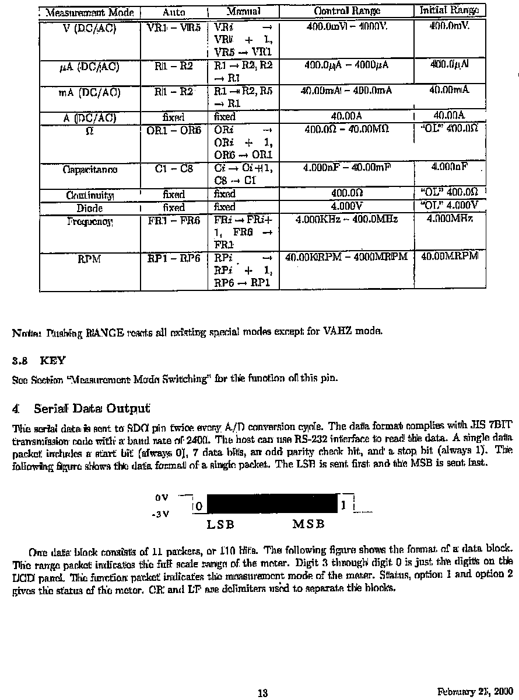
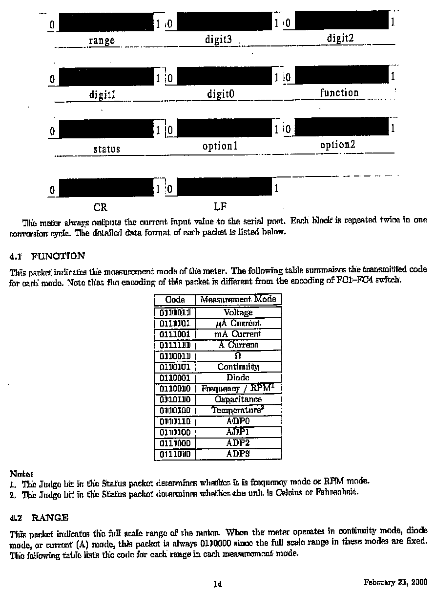
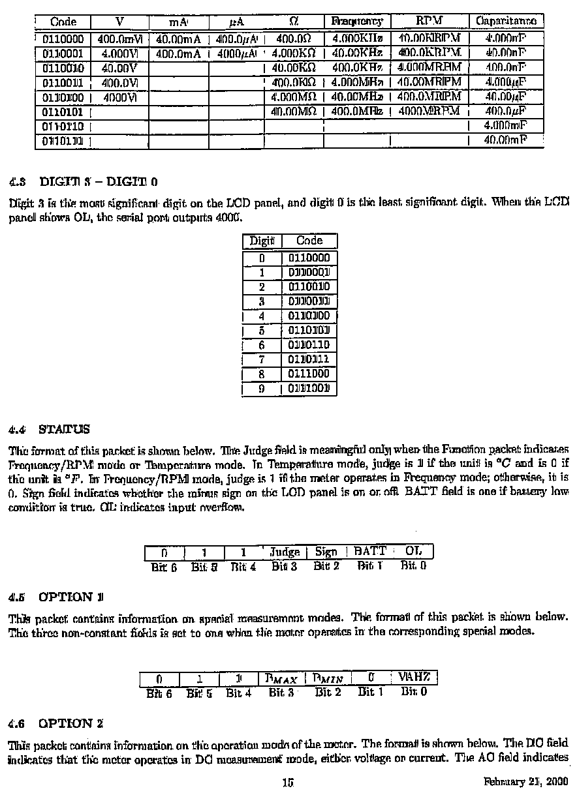
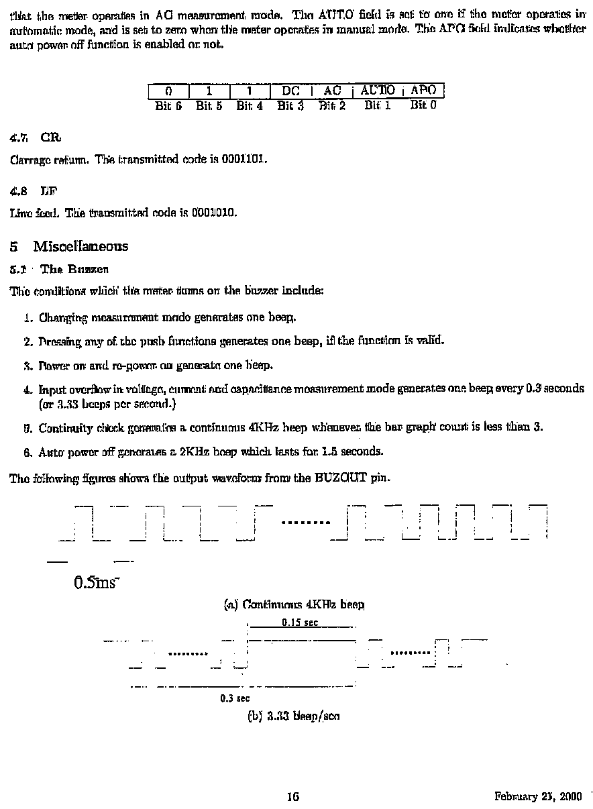

# BK-Precision-390A

When I first purchased my 390A I couldn't find any documents anywhere for communicating with the serial port.
Finally I contacted the company and what they sent me are the fax of a fax of a fax of a fax images that you
are seeing. If you've never tried to fax a document that was already faxed I can tell you that they degrade
extremely quickly. As bad as they are it is almost impossible to decipher the bit patterns provided in the
tables. So I finally decided to try using OpenAI's 'OCR with GTP Vision' AI to read and convert the document.
The initial results are amazing compared to any non-AI OCR software.

Today is Jan. 4, 2025 when I am posting the non-verified result from the AI. I say non-verified because I 
haven't read and compared the results. Any bit patterns will have to be tested in code.

This [github project](https://github.com/TechRelief/BK390A-Display/blob/master/BK390A-Display/BK390Decoder.cs)
 may provide some additional insights into the original document.

OCR'd Serial Protocol for the BK Precision 390A VOM

#### Measurement Modes and Ranges

| Measurement Mode | Auto                  | Manual                      | Control Range                | Initial Range |
|------------------|-----------------------|-----------------------------|------------------------------|---------------|
| V (DC/AC)        | VR1 → VR5            | VR4 → VR1 + 1, VR5 → VR1    | 400.0mV → 1000V             | 400.0mV       |
| µA (DC/AC)       | R1 → R2              | R1 → R2, R2 → R1            | 400.0µA → 4000µA            | 400.0µA       |
| mA (DC/AC)       | R1 → R2              | R1 → R2, R5 → R1            | 40.00mA → 400.0mA           | 40.00mA       |
| A (DC/AC)        | fixed                | fixed                       | 40.00A                      | 40.00A        |
| Ω                | OR1 → OR8            | OR8 → OR8 + 1, OR8 → OR1    | 400.0Ω → 40.00MΩ            | "OL" 400.0Ω   |
| Capacitance      | C1 → C8              | C1 → C8 + 1, C8 → C1        | 4.000nF → 40.00mF           | 4.000nF       |
| Continuity       | fixed                | fixed                       | 400.0Ω                      | "OL" 400.0Ω   |
| Diode            | fixed                | fixed                       | 4.000V                      | "OL" 4.000V   |
| Frequency        | FR1 → FR6            | FR1 → FR1 + 1, FR6 → FR1    | 4.000KHz → 400.0MHz         | 4.000MHz      |
| RPM              | RP1 → RP6            | RP1 → RP1 + 1, RP6 → RP1    | 40.00KRPM → 4000MRPM        | 40.00KRPM     |

#### Notes
- Pushing RANGE resets all existing special modes except for VAHz mode.

#### 3.8 Key
See Section "Measurement Mode Switching" for the function of this pin.

#### 4. Serial Data Output
This serial data is sent to the SDO pin twice every A/D conversion cycle. The data format complies with HIS 7BIT
transmission code with a baud rate of 2400. The host can use the RS-232 interface to read the data.
Each packet includes:
- 1 start bit (always 0),
- 7 data bits,
- 1 odd parity check bit,
- and 1 stop bit (always 1).

The following figure shows the data format of a single packet. The LSB is sent first, and the MSB is sent last.

#### Data Block Description
- One data block consists of 11 packets, or 110 bits.
- The following figure shows the format of a data block:
  - The range packet indicates the full scale range of the meter.
  - Digits 3 through 0 represent the digits on the LCD panel.
  - Function packet indicates the measurement mode of the meter.
  - Status, Option 1, and Option 2 give additional information about the meter.

CR and LF are delimiters used to separate the blocks.

Page 13

Serial Data Format and Function

This meter always outputs the current input value to the serial port. Each block is repeated twice in one
conversion cycle. The detailed data format of each packet is listed below.

#### **4.1 FUNCTION**
This packet indicates the measurement mode of the meter. The following table summarizes the transmitted code
for each mode. Note that the encoding of this packet is different from the encoding of FC1–FC4 switch.

| Code      | Measurement Mode  |
|-----------|-------------------|
| 01110101  | Voltage           |
| 01111000  | µA Current        |
| 01110001  | mA Current        |
| 01111111  | A Current         |
| 01100001  | Ω                 |
| 01100011  | Continuity        |
| 01100001  | Diode             |
| 01100100  | Frequency/RPM     |
| 01101110  | Capacitance       |
| 01101000  | Temperature       |
| 01111010  | ADP0              |
| 01111100  | ADP1              |
| 01111000  | ADP2              |
| 01111010  | ADP3              |

**Notes:**
1. The Judge bit in the Status packet determines whether it is frequency mode or RPM mode.
2. The Judge bit in the Status packet determines whether the unit is Celsius or Fahrenheit.

#### **4.2 RANGE**
This packet indicates the full scale range of the meter. When the meter operates in continuity mode, diode
mode, or current (A) mode, this packet is always 0110000 since the full scale range in these modes are fixed.
The following table lists the code for each range in each measurement mode.

| Code     | V        | mA      | µA       | Ω       | Frequency  | RPM         | Capacitance |
|----------|----------|---------|----------|---------|------------|-------------|-------------|
| 0110000  | 400.0mV  | 40.00mA | 400.0µA  | 400.0Ω  | 4.000KHz   | 40.00KRPM   | 4.000nF     |
| 0110001  | 4.000V   | 400.0mA | 4.000µA  | 4.000KΩ | 40.00KHz   | 400.0KRPM   | 40.00nF     |
| 0110010  | 40.00V   |         |          |         | 400.0KHz   | 4.000MRPM   |             |
| 0110011  | 400.0V   |         |          | 400.0KΩ | 4.000MHz   |             | 4.000µF     |
| 0110100  | 4000V    |         |          | 4.000MΩ | 40.00MHz   |             | 40.00µF     |
| 0110101  |          |         |          |         | 400.0MHz   |             | 400.0µF     |
| 0110110  |          |         |          |         |            |             | 4.000mF     |
| 0110111  |          |         |          |         |            |             | 40.00mF     |

Page 14

Digits and Status

#### **4.3 DIGIT 3 – DIGIT 0**
Digit 3 is the most significant digit on the LCD panel, and digit 0 is the least significant digit. When the LCD
panel shows OL, the serial port outputs 4000.

| Digit | Code     |
|-------|----------|
| 0     | 0110000  |
| 1     | 0110001  |
| 2     | 0110010  |
| 3     | 0110011  |
| 4     | 0110100  |
| 5     | 0110101  |
| 6     | 0110110  |
| 7     | 0110111  |
| 8     | 0111000  |
| 9     | 0111001  |

#### **4.4 STATUS**
The format of this packet is shown below. The Judge field is meaningful only when the Function packet indicates
Frequency/RPM mode or Temperature mode. In Temperature mode, Judge is 1 if the unit is °C and is 0 if the unit
is °F. In Frequency/RPM mode, Judge is 1 if the meter operates in Frequency mode; otherwise, it is 0. The Sign
field indicates whether the minus sign on the LCD panel is on or off. BATT field is one if battery low condition
is true. OL indicates input overflow.

| Bit 6 | Bit 5 | Bit 4 | Bit 3   | Bit 2 | Bit 1 | Bit 0 |
|-------|-------|-------|---------|-------|-------|-------|
|   0   |   1   |   1   | Judge   |  Sign | BATT  |  OL   |

#### **4.5 OPTION 1**
This packet contains information on special measurement modes. The format of this packet is shown below.
The three non-constant fields are set to one when the meter operates in the corresponding special modes.

| Bit 6 | Bit 5 | Bit 4 | Bit 3  | Bit 2 | Bit 1 | Bit 0 |
|-------|-------|-------|--------|-------|-------|-------|
|   0   |   1   |   1   | PMAX   | PMIN  | V/AHz |       |

#### **4.6 OPTION 2**
This packet contains information on the operation modes of the meter. The format is shown below. The DC field
indicates that the meter operates in DC measurement mode, either voltage or current. The AC field indicates
that the meter operates in AC measurement mode. The AUTO field is set to one if the meter operates in automatic
mode and is set to zero when the meter operates in manual mode. The APO field indicates whether auto power off
function is enabled or not.

| Bit 6 | Bit 5 | Bit 4 | Bit 3 | Bit 2 | Bit 1 | Bit 0 |
|-------|-------|-------|-------|-------|-------|-------|
|   0   |   1   |  DC   |  AC   | AUTO  | APO   |       |

Page 15

#### **4.3 DIGIT 3 – DIGIT 0**
Digit 3 is the most significant digit on the LCD panel, and digit 0 is the least significant digit. When the LCD
panel shows OL, the serial port outputs 4000.

| Digit | Code      |
|-------|-----------|
| 0     | 0110000   |
| 1     | 01100001  |
| 2     | 01100100  |
| 3     | 01100011  |
| 4     | 01101000  |
| 5     | 01101001  |
| 6     | 01101100  |
| 7     | 01101101  |
| 8     | 01101110  |
| 9     | 01101111  |

#### **4.4 STATUS**
The format of this packet is shown below. The Judge field is meaningful only when the Function packet indicates
Frequency/RPM mode or Temperature mode. In Temperature mode, Judge is 1 if the unit is °C and is 0 if the unit
is °F. In Frequency/RPM mode, Judge is 1 if the meter operates in Frequency mode; otherwise, it is 0. The Sign
field indicates whether the minus sign on the LCD panel is on or off. BATT field is one if battery low condition
is true. OL indicates input overflow.

| Bit 6 | Bit 5 | Bit 4 | Bit 3   | Bit 2 | Bit 1 | Bit 0 |
|-------|-------|-------|---------|-------|-------|-------|
|   0   |   1   |   1   | Judge   |  Sign | BATT  |  OL   |

#### **4.5 OPTION 1**
This packet contains information on special measurement modes. The format of this packet is shown below.
The three non-constant fields are set to one when the meter operates in the corresponding special modes.

| Bit 6 | Bit 5 | Bit 4 | Bit 3  | Bit 2 | Bit 1 | Bit 0 |
|-------|-------|-------|--------|-------|-------|-------|
|   0   |   1   |   1   | PMAX   | PMIN  | V/AHz |       |

#### **4.6 OPTION 2**
This packet contains information on the operation modes of the meter. The format is shown below. The DC field
indicates that the meter operates in DC measurement mode, either voltage or current. The AC field indicates
that the meter operates in AC measurement mode. The AUTO field is set to one if the meter operates in automatic
mode and is set to zero when the meter operates in manual mode. The APO field indicates whether auto power off
function is enabled or not.

| Bit 6 | Bit 5 | Bit 4 | Bit 3 | Bit 2 | Bit 1 | Bit 0 |
|-------|-------|-------|-------|-------|-------|-------|
|   0   |   1   |  DC   |  AC   | AUTO  | APO   |       |

Page 16

